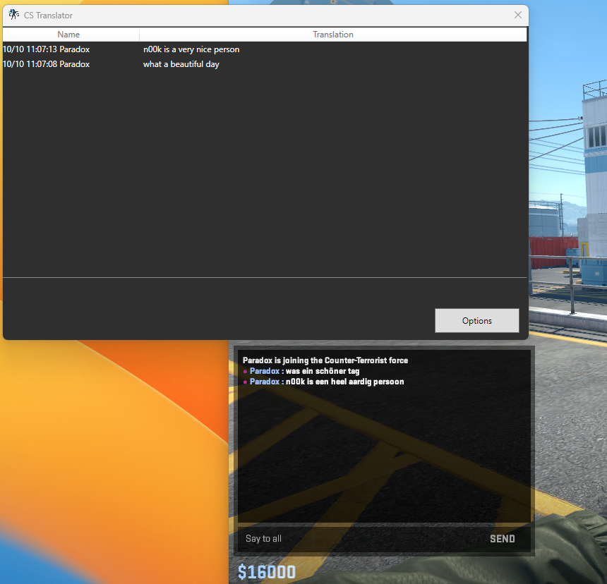
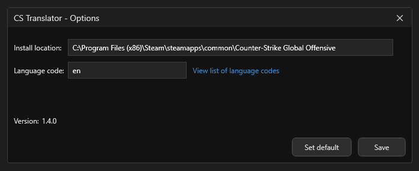

# CS2-Translator
Easy to use CS2 chat translation tool. 

You probably know the feeling of not being able to communicate in a match because everyone speaks a different language.
Well, gone are those days. With this tool you can read translations of all foreign language messages while staying in the game.

CS2-Translator will read the console output, detect chat messages, and then translate them with Google Translate.

All of this is accomplished using official CS2 launch options.

## How to use

1. Download the [latest Installer](https://github.com/ParadoxLeon/CS2-Translator/releases) (or build it yourself)
2. Run the Installer (you will get a warning while installing this is because the app is not signed)
3. Set CS2 launch options: `-condebug` ([how do I do this?](https://support.steampowered.com/kb_article.php?ref=1040-JWMT-2947)) 
4. start CS2 & CS2 Translator
5. (Optional) Change the options in CS2 Translator to your liking. ([List of language codes](https://cloud.google.com/translate/docs/languages))

## Update

To update the translator just download the [latest Installer](https://github.com/ParadoxLeon/CS2-Translator/releases) (or build it yourself) and run it 

## Features & Examples

### Translations
  

### Options
  

### Other features
* Very simple to use
* Lots of languages supported ([Full list of language codes](https://cloud.google.com/translate/docs/languages))
* Translations are cached, so the same translation is used for identical messages.
* Will work with all CS2 install locations.
* Everything done from in the game, no need to Alt + Tab.
* New version notification

### Current limitations
* The current method of using Google Translate is rate-limited at 100 requests / hour.
* Can't detect messages on certain community servers because of different chat structures.

### What I changed:
- switched to Dark Mode
- removed options for telnet
- changed the default location
- (sadly) added a Installer
- added Text wrapping

### What's on my todo:
- language detection (to see the language code of the translated text)
